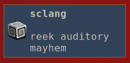

# sc-notify
__get your notification on__
* tested with `mako` on `sway`

## Linux/BSD only!
* `cargo build`
* `export TMP_PATH=$HOME/.local/share/SuperCollider/Extensions/SCNotify`
* `cd <ROOT_OF_THIS_REPO`
* `mkdir -p $TMP_PATH && cp SCNotify.sc target/debug/sc-notify $TMP_PATH` 
* open `example.scd`

